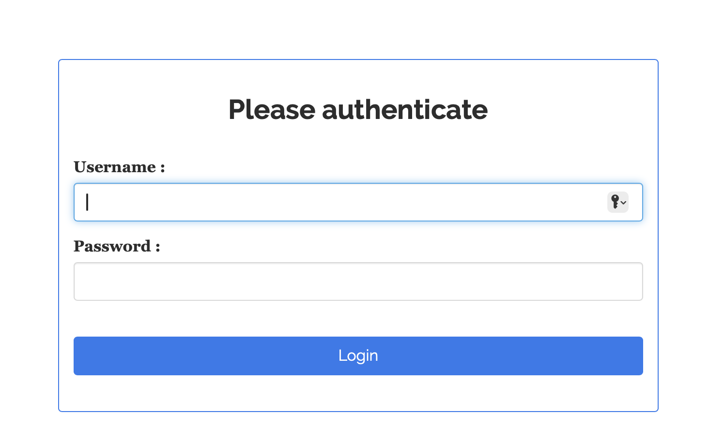
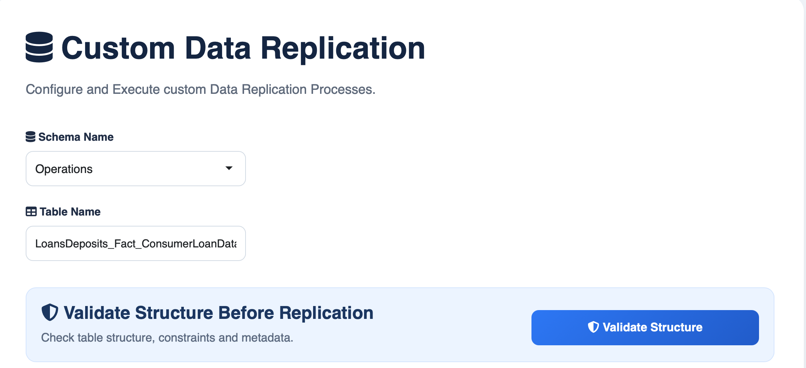
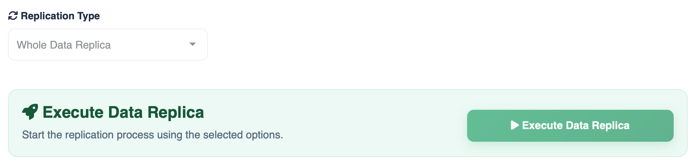
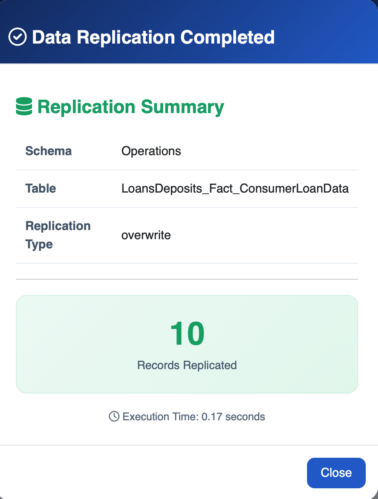

# management-sandbox
## Shiny Application for Manage Replication to a Sandbox Environment

Developed using the [Shiny Package](https://shiny.posit.co) (a library that enables the creation of Web Applications using R or Python languages) the main purpose of the "management-sandbox" app is to work as a Replication Data Hub to move Data from a Source Production Relational Database to a "mirror" environment called Sandbox.

This repository includes the code files that compose the Shiny Application, it's User Database and an Informational Example Database to test the functionalities of the Software.

## Technologies

- R
- Shiny
- PostgreSQL
- ODBC
- pgcrypto

## Prerequisites

The project has been tested with the following software versions:

|Software|Version|
|--------|-------|
| R      | 4.2.2 |
| PostgreSQL| 17.4|

Libraries versions:

|Software|Library|Version|
|--------|-------|-------|
|R|shiny|1.7.4|
|R|shinyjs|2.1.1|
|R|shinymanager|1.0.410|
|R|htmltools|0.5.4|
|R|shinyWidgets|0.9.1|
|R|tidyverse|1.3.2|
|R|DBI|1.3.0|
|R|Shiny|1.4.10|
|PostgreSQL|pgcrypto|1.4|

## Introduction (Use case)

Consider an enterprise architecture composed of a Production Environment and a Sandbox Environment. The Production environment hosts the organization’s operational database and supports business applications, reporting, and daily operations. The Sandbox Environment maintains a synchronized replica of this system, providing Data Analysts, Data Scientists, and other engineering teams with an isolated workspace for computationally intensive experimentation, model development, and data exploration without impacting production performance.

The management-sandbox application automates and manages the replication workflows that synchronize the sandbox with production, ensuring that non-production environments remain current while minimizing operational risk and eliminating resource contention with production workloads.

## Architecture

Initially, the application is designed around a two-tier architecture. The first tier consists of a PostgreSQL database (SandboxAppManagement) that stores user authentication and authorization information. This database provides an additional security layer by requiring users to authenticate before accessing the application. User passwords are securely encrypted using the [pgcrypto](https://www.postgresql.org/docs/current/pgcrypto.html) extension, which provides cryptographic functions for PostgreSQL. The second tier contains the application’s Shiny interface, business logic, and shared resources required for execution.

For the analytical ecosystem, it is assumed that the Production and Sandbox databases reside on separate database servers. Consequently, the application must be able to communicate with both servers through independent ODBC connections.

Additionally, a dedicated database role will be created in each environment with privileges aligned to the application’s operational requirements. In the Production environment, the role will be restricted to read-only operations to protect production data. In contrast, the role in the Sandbox environment will be granted read and write privileges, allowing the application to execute data replication and management tasks while maintaining the security and integrity of the Production environment.

## The "Bank of Trust" example and the Analytical Model

Using the [BIAN Service Domain Landscape](https://bian.org/servicelandscape-12-0-0/views/view_51891.html) and Kimball's Dimensional Aproach [^1] as a reference for Designing our Relational Data Model for a fictional Banking Institution called "Bank of Trust", we can test our application on the following objects:

### ERD Diagram

### Data Catalog

*Schemas*

- Operations: Store information about product fulfillment activities for wholesale and retail Banking, including Loans and Deposits, Cards, Market Operations, etc.
- SalesServices: Store information about business development, marketing, customer management, cross chanel and sales activities.
- BusinessSupport: Store information about general business management and support activities that are not specific to Banking, including Human Resoruce Management, Finance, IT Management, Building Equipment, etc.

*Tables*

- CustomersCatalog (Dimension Table): Store the Customers' relevant information, such as Name, Ocuppation, Opening Date for their accounts, etc.
- EmployeesCatalog (Dimension Table): Store the relevant information of the Bank's Employees, such as Names, Status, Start Date, etc.
- ConsumerLoanData (Fact Table): Store the Oustanding Balance at the end of the Month for the Loan Accounts of the Customers in the BoT.
- CreditCardsTransactions (Fact Table): Store the information of the Daily Transactions that are made by the customers specifically for the Credit Card product.

## Analytical Databases Set Up

Detailed database configuration instructions for the analytical environment are available in:

- [Database Set Up Documentation](docs/analytical-databases-setup.md)

## Application Configuration

The detailed process to configure the application Roles and Connections are available in:

- [Application Configuration Documentation](docs/application-configuration.md)

## Features

- Role-based access control

- Metadata validation before replication

  
- Automated table replication

  
- Execution summary with replication statistics

  

## Feedback

As this is my first project, you can encounter a lot of areas for improvement, so any thoughts, suggestions, feedback and recommendations are more than welcome.
If you run into any issues, have a question, or want to suggest an improvement, please feel free to [open an issue](https://github.com/David97A) or reach out to me directly at [my email](mailto:davidaguirredataanalyst101@gmail.com).

Thanks for reading.

## References

[^1]: Kimball, R., & Ross, M. (2002). The data warehouse toolkit (2nd edn). Nashville, TN: John Wiley & Sons.
