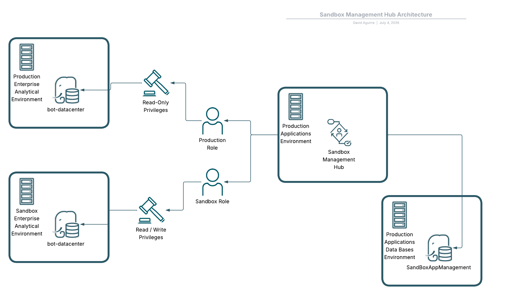
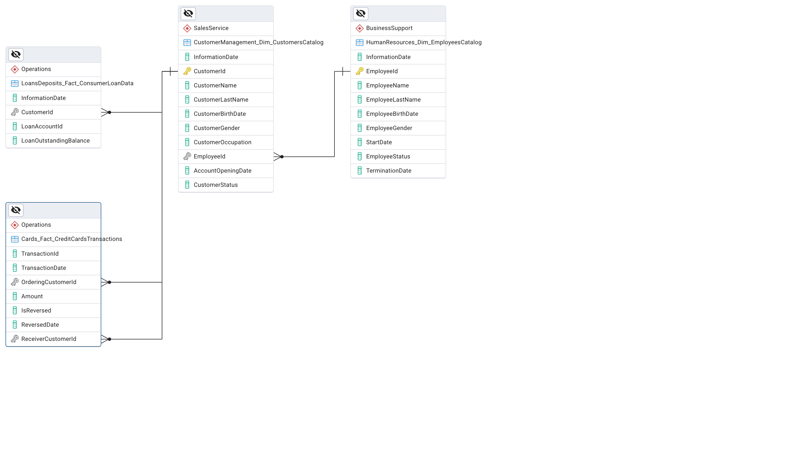

# management-sandbox
## Shiny Application for Manage a Sandbox Environment

Developed using the Shiny package which allow us to create Web Applications in the R language, the main purpose of the "management-sandbox" app is to work as a Replication Data Hub to move Data from a Source Production Relational Database to a "mirror" environment called Sandbox.

This repository includes the code files that compose the Shiny Application, it's User Database and an Informational Example Data Base to test the functionalities of the Software.

## Introduction (Use case)

Supposing that we have a Production Environment that hosts an Analytical Database that stores enterprise Data, and a Sandbox Environment that mirrors the Production instance to allow Data teams, such as Data Analysts and Data Scientists, to run "heavy-weight" tests for developing Models and Explorations without competing with the operational processes for computational resources, the "management-sandbox" app offers a solution to manage the data replications needed to maintain the Sandbox ecosystem up to date againts any updates in the information that could occur in Production.

## Architecture

Initially, a 2 tier architecture is proposed for the application, having a PostgreSQL Database (SandboxAppManagement) where we're going to store the information related to user's credentials. This will enable to add a secure layer to the software requesting user name and password to the user who will use the application. The password values for each user will be encrypted using the [pgcrypto](https://www.postgresql.org/docs/current/pgcrypto.html) module, which is a PostgreSQL extension that "provides cryptographic functions".

For the Analytical Ecosystem, it is assumed that the Production and Sandbox databases are located on two different servers, so it would be necessary to ensure the communication between the application and both servers, and a ODBC connection for each database. Also, in each database will be created a Role with different privileges for the operations that the application can execute, ensuring that in the Production database can perform "Read-Only" transactions, meanwhile in the Sandbox environment it's allowed to perform "Read / Write" commands.

## The "Bank of Trust" example and the Analytical Model

Using the [BIAN Service Domain Landscape](https://bian.org/servicelandscape-12-0-0/views/view_51891.html) as a reference for Designing our Relational Data Model for a fictitional Banking Institution called "Bank of Trust", we can test our application on the following objects:

